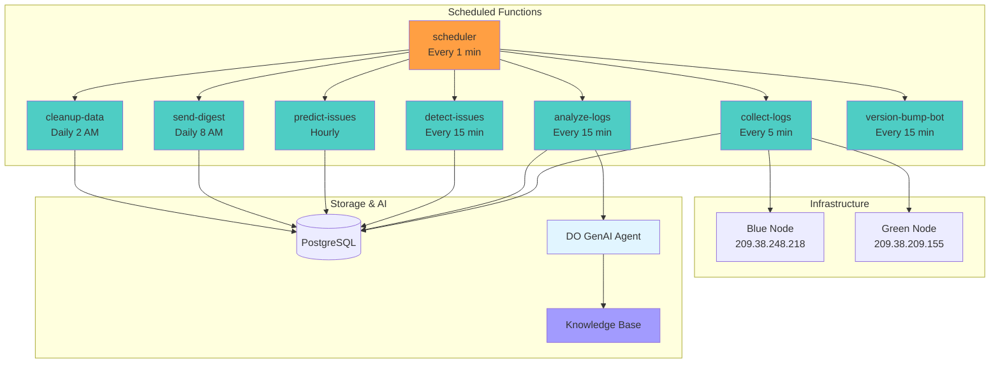

# FleexStack Monitoring Documentation

Serverless log monitoring system using DigitalOcean Functions with AI-powered analysis.

## Quick Navigation by Role

### Operators
- [Quick Start](./quickstart.md) - Deploy in 5 minutes
- [Operator Guide](./operators.md) - Deployment, monitoring, maintenance
- [Debugging Guide](./debugging.md) - Troubleshooting DO Functions

### Developers
- [Developer Guide](./developers.md) - Implementation details, extending functions
- [Architecture](./architecture.md) - System diagrams and data flows
- [E2E Integration](./e2e-integration.md) - CI/CD verification setup

### Advanced Features
- [Knowledge Base Integration](./knowledge-base-integration.md) - AI context with runbooks
- [Spaces Docs Sync](./auto/spaces-docs-sync.md) - Documentation sync workflow

## Architecture Overview

## Functions Overview

| Function | Schedule | Description |
|----------|----------|-------------|
| `collect-logs` | Every 5 min | Fetch logs from blue/green nodes |
| `analyze-logs` | Every 15 min | AI-powered log analysis via DO GenAI |
| `detect-issues` | Every 15 min | Pattern-based issue detection |
| `predict-issues` | Hourly | Trend analysis and predictions |
| `send-digest` | Daily 8 AM | Daily summary report |
| `cleanup-data` | Daily 2 AM | Clean old logs and issues |
| `sync-docs-to-spaces` | Manual | Sync GitHub docs to DO Spaces for KB |
| `ai-agent-get-runbook` | On-demand | Retrieve runbook for issue type |
| `ai-agent-search-incidents` | On-demand | Search resolved incidents |
| `ai-agent-search-github-issues` | On-demand | Search closed GitHub issues |
| `analyze-e2e-results` | On-demand | Analyze E2E verification results with AI |
| `fleexstack-sample-app-version-bump-bot` | Every 15 min | Auto-increment version in sample app |

## Key Features

- **Serverless**: No infrastructure to manage, auto-scaling
- **AI Analysis**: DO GenAI agent analyzes logs for anomalies
- **Pattern Detection**: Automatic detection of error spikes, memory issues
- **Issue Deduplication**: Updates existing issues instead of creating duplicates
- **Auto-Resolution**: Closes issues when patterns disappear
- **GitHub Integration**: Daily digest and alerts via GitHub Issues
- **Cost Effective**: Runs within DO Functions free tier (~15k invocations/month)

## Repository

**GitHub**: [MikeBild/fleexstack-monitoring](https://github.com/MikeBild/fleexstack-monitoring)

## Quick Links

### Setup & Configuration
- [Environment Variables](./operators.md#environment-variables)
- [Database Schema](./developers.md#database-schema)
- [GenAI Integration](./developers.md#genai-integration)

### Operations
- [Manual Invocation](./operators.md#invoke-functions-manually)
- [View Activations](./operators.md#view-activations)
- [Common Issues](./debugging.md#common-issues)

### Advanced
- [Knowledge Base Setup](./knowledge-base-integration.md#quick-start-operators)
- [E2E Verification](./e2e-integration.md#setup)
- [Adding Detection Patterns](./developers.md#adding-issue-detection-patterns)
