# Architecture Documentation

Complete workflow visualization of the FleexStack monitoring system.

## System Overview

## Data Flow

## Function Workflows

### 1. collect-logs

### 2. analyze-logs

### 3. detect-issues

### 4. predict-issues

### 5. send-digest

### 6. cleanup-data

### 7. fleexstack-sample-app-version-bump-bot

## Issue Creation Flow

## Database Schema

## Timing Schedule

```mermaid
gantt
    title Function Execution Schedule (24h)
    dateFormat HH:mm
    axisFormat %H:%M

    section Every 5 min
    collect-logs    :crit, 00:00, 5m
    collect-logs    :crit, 00:05, 5m
    collect-logs    :crit, 00:10, 5m

    section Every 15 min
    analyze-logs    :active, 00:00, 5m
    detect-issues   :active, 00:00, 5m
    analyze-logs    :active, 00:15, 5m
    detect-issues   :active, 00:15, 5m

    section Hourly
    predict-issues  :00:00, 5m
    predict-issues  :01:00, 5m

    section Daily
    cleanup-data    :02:00, 10m
    send-digest     :08:00, 5m
```

## Environment Dependencies

## Severity Levels

| Level | Color | Description | Action Required |
|-------|-------|-------------|-----------------|
| critical | Red | System down or data loss | Immediate |
| high | Orange | Service degradation | Within 1 hour |
| medium | Yellow | Potential issues | Within 24 hours |
| low | Blue | Informational | Review when convenient |

## Issue Lifecycle

## Issue Deduplication Flow

## Auto-Resolution Flow

