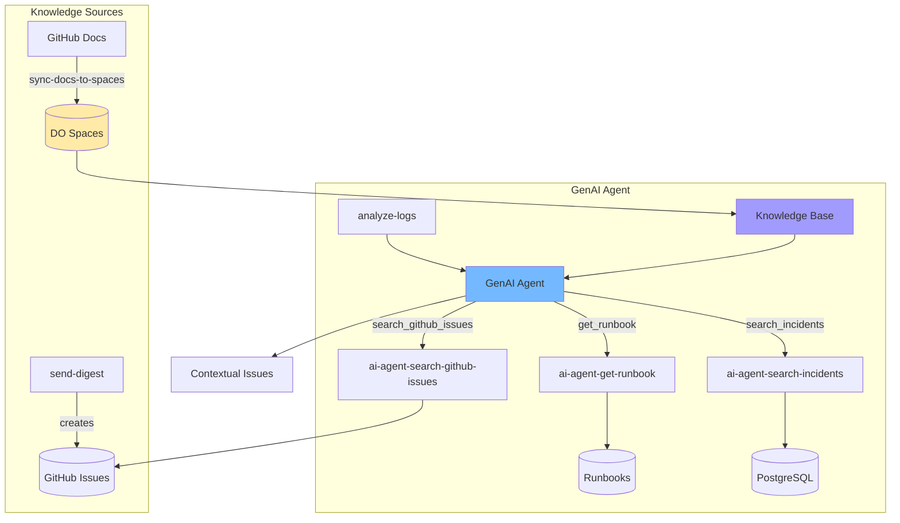
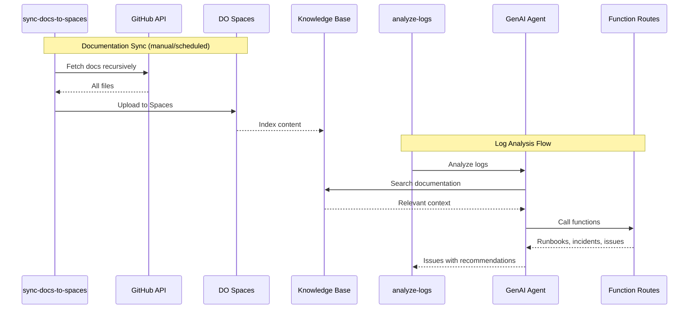

# Knowledge Base Integration

Enhance GenAI log analysis with operational knowledge for context-aware recommendations.

> **Related**: [Architecture](./architecture.md) | [Developer Guide](./developers.md) | [Operator Guide](./operators.md)

## Overview



---

## Quick Start (Operators)

Deploy knowledge base integration in 5 minutes.

### Prerequisites

- doctl configured with DO API token
- Existing fleexstack-monitoring deployment
- GitHub token with repo access

### 1. Deploy Functions

```bash
doctl serverless deploy .
```

### 2. Create Spaces Bucket

Go to https://cloud.digitalocean.com/spaces and create:
- **Name**: `fleexstack-monitoring`
- **Region**: `fra1`

### 3. Sync Documentation

```bash
doctl serverless functions invoke monitoring/sync-docs-to-spaces
```

### 4. Create & Attach Knowledge Base

```bash
# Get project ID and agent UUID
PROJECT_ID=$(doctl projects list -o json | jq -r '.[0].id')
AGENT_UUID=$(doctl genai agent list -o json | jq -r '.[0].uuid')

# Create KB
doctl genai knowledge-base create \
  --name "fleexstack-docs" \
  --region "tor1" \
  --project-id "$PROJECT_ID" \
  --embedding-model-uuid "22653204-79ed-11ef-bf8f-4e013e2ddde4" \
  --data-sources '[{"spaces_data_source":{"bucket_name":"fleexstack-monitoring","item_path":"/docs","region":"fra1"}}]'

# Get KB UUID from output, then attach
KB_UUID=$(doctl genai knowledge-base list -o json | jq -r '.[] | select(.name=="fleexstack-docs") | .uuid')
doctl genai knowledge-base attach $AGENT_UUID $KB_UUID
```

### 5. Configure Function Routes

```bash
# AGENT_UUID already set in step 4
FAAS_NS=$(doctl serverless namespaces list -o json | jq -r '.[0].namespace')

# Add all three routes
doctl genai agent functionroute create \
  --agent-id "$AGENT_UUID" \
  --name "get_runbook" \
  --description "Retrieve remediation runbook for issue type" \
  --faas-name "monitoring/ai-agent-get-runbook" \
  --faas-namespace "$FAAS_NS" \
  --input-schema '{"parameters":[{"name":"issue_type","in":"query","schema":{"type":"string"},"required":true,"description":"Issue type"}]}' \
  --output-schema '{"properties":{"runbook":{"type":"string"}}}'

doctl genai agent functionroute create \
  --agent-id "$AGENT_UUID" \
  --name "search_incidents" \
  --description "Search resolved incidents in database" \
  --faas-name "monitoring/ai-agent-search-incidents" \
  --faas-namespace "$FAAS_NS" \
  --input-schema '{"parameters":[{"name":"keywords","in":"query","schema":{"type":"string"},"required":true,"description":"Search keywords"}]}' \
  --output-schema '{"properties":{"incidents":{"type":"array"}}}'

doctl genai agent functionroute create \
  --agent-id "$AGENT_UUID" \
  --name "search_github_issues" \
  --description "Search closed GitHub issues" \
  --faas-name "monitoring/ai-agent-search-github-issues" \
  --faas-namespace "$FAAS_NS" \
  --input-schema '{"parameters":[{"name":"keywords","in":"query","schema":{"type":"string"},"required":true,"description":"Search keywords"}]}' \
  --output-schema '{"properties":{"issues":{"type":"array"}}}'
```

### 6. Test

```bash
doctl serverless functions invoke monitoring/ai-agent-get-runbook -p issue_type:high-error-rate
doctl serverless functions invoke monitoring/ai-agent-search-incidents -p keywords:memory
doctl serverless functions invoke monitoring/ai-agent-search-github-issues -p keywords:error
```

---

## Detailed Guide (Developers)

### Architecture



### Components

| Component | Purpose | Source |
|-----------|---------|--------|
| `sync-docs-to-spaces` | Sync GitHub docs to Spaces | GitHub API → DO Spaces |
| Knowledge Base | Vector search on documentation | DO Spaces |
| `ai-agent-get-runbook` | Retrieve runbook by issue type | Local files |
| `ai-agent-search-incidents` | Search resolved incidents | PostgreSQL |
| `ai-agent-search-github-issues` | Search closed issues | GitHub API |

### Environment Variables

```bash
# Required for all functions
DATABASE_URL=postgresql://...
GH_TOKEN=ghp_...
ALERTS_REPO=MikeBild/fleexstack

# Required for sync-docs-to-spaces
SPACES_ACCESS_KEY_ID=DO...
SPACES_SECRET_ACCESS_KEY=...
SPACES_BUCKET=fleexstack-monitoring
SPACES_REGION=fra1
DOCS_REPO=MikeBild/fleexstack
DOCS_PATH=docs

# GenAI Agent
GENAI_AGENT_URL=https://<id>.agents.do-ai.run
```

### Function: sync-docs-to-spaces

Recursively syncs all files from a GitHub repo to DO Spaces for Knowledge Base indexing.

**Features:**
- Traverses directories recursively
- Preserves folder structure
- Supports md, json, yaml, and other text files
- Public-read ACL for KB access

**Invoke manually:**
```bash
doctl serverless functions invoke monitoring/sync-docs-to-spaces
```

### Function: ai-agent-get-runbook

Returns runbook content for a specific issue type.

**Issue Types:**
| Type | Trigger Condition |
|------|-------------------|
| `high-error-rate` | Error rate > 5% |
| `repeated-error` | Same error 5+ times |
| `memory-warning` | 3+ memory warnings |
| `connection-failure` | Any connection error |

**Example runbook** (`knowledge/runbooks/high-error-rate.md`):
```markdown
# High Error Rate

**Causes**: DB pool exhaustion, OOM, downstream failure

**Check**:
- DB: `SELECT count(*) FROM pg_stat_activity`
- Memory: `docker stats`

**Fix**:
1. Increase pool size
2. Restart service
3. Check downstream health
```

> **Note**: Knowledge files must be in function directory: `packages/monitoring/ai-agent-get-runbook/knowledge/`

### Function: ai-agent-search-incidents

Searches resolved issues in PostgreSQL for similar past incidents.

**Search columns**: `title`, `description`, `rootCause` (ILIKE)

> See [Architecture - Database Schema](./architecture.md#database-schema) for full LogIssue table definition.

### Function: ai-agent-search-github-issues

Searches closed GitHub issues for past resolutions.

**Returns:**
- Issue number, title, body
- Labels
- Last comment as resolution

### project.yml Configuration

```yaml
packages:
  - name: monitoring
    functions:
      - name: sync-docs-to-spaces
        runtime: nodejs:18
        main: main
        web: true
        limits:
          timeout: 120000
          memory: 256

      - name: ai-agent-get-runbook
        runtime: nodejs:18
        main: main
        web: true
        limits:
          timeout: 30000
          memory: 128

      - name: ai-agent-search-incidents
        runtime: nodejs:18
        main: main
        web: true
        limits:
          timeout: 30000
          memory: 128

      - name: ai-agent-search-github-issues
        runtime: nodejs:18
        main: main
        web: true
        limits:
          timeout: 30000
          memory: 128
```

### analyze-logs Integration

The `analyze-logs` function uses this system prompt:

```javascript
const systemPrompt = `You are a log analysis assistant for FleexStack monitoring.

IMPORTANT: Use available functions to provide context-aware recommendations:
- get_runbook(issue_type) - retrieve remediation steps
- search_incidents(keywords) - find similar past resolved incidents
- search_github_issues(keywords) - find closed GitHub issues with resolutions

For each issue you identify:
1. Call get_runbook with the issue type
2. Call search_incidents with relevant keywords
3. Call search_github_issues for GitHub resolutions
4. Include specific recommendations from all sources

Return a JSON object with an "issues" array containing:
- type, severity, title, description
- rootCause (from runbook/incidents/GitHub)
- recommendation (specific steps)`
```

**Configuration:**
- `max_tokens: 2000` (detailed responses)
- `timeout: 60000` (function call overhead)

---

## Maintenance

### Update Documentation

```bash
# Sync latest docs from GitHub
doctl serverless functions invoke monitoring/sync-docs-to-spaces
```

### Add Runbooks

1. Create file in `packages/monitoring/ai-agent-get-runbook/knowledge/runbooks/<type>.md`
2. Deploy: `doctl serverless deploy .`

### Post-Mortem Template

```markdown
# Incident Title

**Date**: YYYY-MM-DD
**Duration**: X minutes
**Severity**: High/Medium/Low
**Impact**: Description of impact

## Timeline
- HH:MM - Event occurred
- HH:MM - Detection
- HH:MM - Resolution

## Root Cause
What caused the incident.

## Resolution
Steps taken to resolve.

## Lessons Learned
- Lesson 1
- Lesson 2

## Action Items
- [ ] Action 1
- [ ] Action 2
```

---

## Troubleshooting

| Issue | Solution |
|-------|----------|
| Sync fails with "Access Denied" | Grant Spaces key access to bucket in Control Panel |
| KB won't attach | Ensure data exists in Spaces and agent has retrieval enabled |
| Function not found | Verify `doctl genai agent get $UUID -o json \| jq '.[0].functions'` |
| Empty runbook | Check file path in `knowledge/runbooks/` directory |
| No incidents | Verify resolved issues exist in database |

### Debug Commands

```bash
# Check function routes
doctl genai agent get $AGENT_UUID -o json | jq '.[0].functions[] | {name, faas_name}'

# View activations
doctl serverless activations list --limit 10

# Check specific activation
doctl serverless activations logs <id>

# Test functions directly
doctl serverless functions invoke monitoring/ai-agent-get-runbook -p issue_type:high-error-rate
```

### Cleanup & Removal

```bash
# Remove function routes
doctl genai agent functionroute delete --agent-id $AGENT_UUID --name get_runbook
doctl genai agent functionroute delete --agent-id $AGENT_UUID --name search_incidents
doctl genai agent functionroute delete --agent-id $AGENT_UUID --name search_github_issues

# Detach and delete knowledge base
doctl genai knowledge-base detach $AGENT_UUID $KB_UUID
doctl genai knowledge-base delete $KB_UUID

# Delete Spaces bucket (via Control Panel or s3cmd)
```

### Known Limitations

- Spaces bucket creation requires Control Panel (not API)
- Spaces keys need explicit bucket permissions
- KB must have data before attaching to agent
- `include` key not supported in project.yml

---

## Expected Results

### High Error Rate

**Before:**
> "High error rate detected"

**After:**
> "High error rate detected. Similar to incident 2024-01 (pool exhaustion). Based on runbook: Check `SELECT count(*) FROM pg_stat_activity`, increase pool size, restart service."

### Memory Warning

**Before:**
> "Memory usage exceeds threshold"

**After:**
> "Memory warning detected on blue node. Previous incident #42 resolved by increasing container memory to 512MB. Runbook suggests: Check `docker stats`, review memory leaks in recent deployments, consider horizontal scaling."

### Connection Failure

**Before:**
> "Database connection failed"

**After:**
> "Connection failure to PostgreSQL. GitHub issue #15 resolved similar issue caused by max_connections limit. Recommended: Check `pg_stat_activity` for idle connections, verify connection pool settings, restart connection pool."
