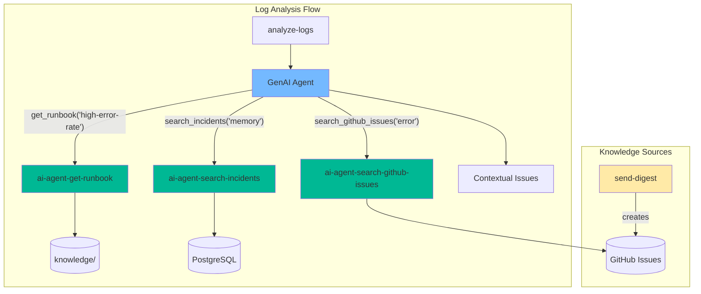
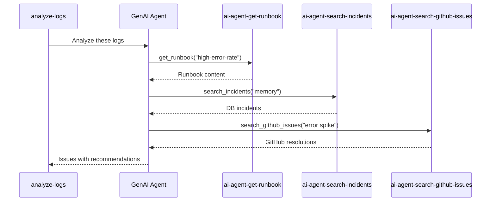
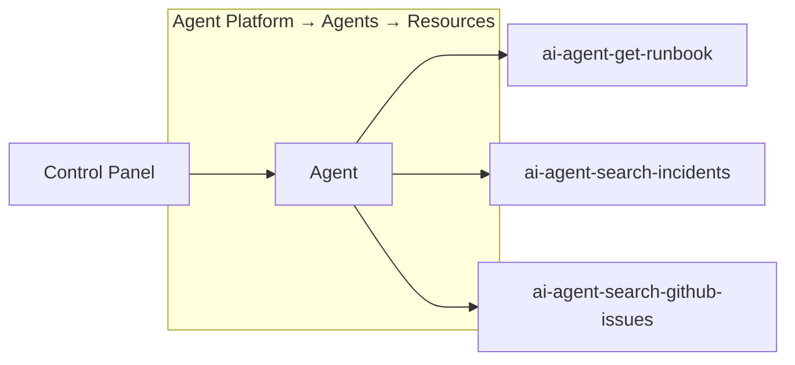
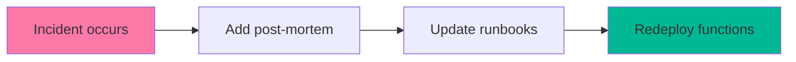

# Knowledge Base Integration

Add operational knowledge to GenAI log analysis using function routing for context-aware recommendations.

## Prerequisites

Before starting, ensure you have:

- [ ] DigitalOcean GenAI Agent created
  - Get `agent_uuid` from: Agent Platform → Agents → Your Agent → Settings
- [ ] DO Functions namespace connected (`doctl serverless connect`)
- [ ] PostgreSQL with `LogIssue` table
- [ ] Environment variables configured:
  - `DATABASE_URL` - PostgreSQL connection string
  - `GENAI_AGENT_URL` - GenAI agent endpoint
  - `GENAI_API_KEY` - GenAI API key (optional)
  - `DO_API_TOKEN` - for API-based configuration
  - `ALERTS_REPO=MikeBild/fleexstack`
  - `GH_TOKEN` - GitHub token with repo access
- [ ] Existing `analyze-logs` function working

### Getting the GenAI Agent URL

1. Go to **DigitalOcean Control Panel → Agent Platform → Agents**
2. Select your agent (or create one with Claude/GPT model)
3. Go to **Settings** tab
4. Copy the **Agent Endpoint URL** (format: `https://<id>.agents.do-ai.run`)
5. Set as environment variable: `GENAI_AGENT_URL=https://<id>.agents.do-ai.run`

---

## Architecture



## How It Works



## Benefits


---

## Step 1: Create Knowledge Structure

### Issue Types

Runbooks should match issue types created by [`detect-issues/index.js`](../packages/monitoring/detect-issues/index.js):

| Type | Created By | Condition |
|------|------------|-----------|
| `high-error-rate` | detect-issues | Error rate > 5% |
| `repeated-error` | detect-issues | Same error 5+ times |
| `memory-warning` | detect-issues | 3+ memory warnings |
| `connection-failure` | detect-issues | Any connection error |
| `error-rate-trending-up` | predict-issues | 50% increase trend |
| `log-volume-spike` | predict-issues | 2x volume spike |
| `ai-detected` | analyze-logs | AI-identified anomaly |

### Directory Structure

```
knowledge/
├── runbooks/
│   ├── high-error-rate.md
│   ├── memory-warning.md
│   ├── connection-failure.md
│   └── repeated-error.md
└── incidents/
    └── example-incident.md
```

See related functions:
- [`detect-issues/index.js`](../packages/monitoring/detect-issues/index.js) - pattern-based detection
- [`predict-issues/index.js`](../packages/monitoring/predict-issues/index.js) - trend prediction
- [`analyze-logs/index.js`](../packages/monitoring/analyze-logs/index.js) - AI analysis

### Example Runbook

`knowledge/runbooks/high-error-rate.md`:

```markdown
# High Error Rate

**Causes**: DB pool exhaustion, OOM, downstream failure

**Check**:
- DB: `SELECT count(*) FROM pg_stat_activity`
- Memory: `docker stats`

**Fix**:
1. Increase pool size
2. Restart service
3. Check downstream health
```

### Example Incident Post-Mortem

`knowledge/incidents/2024-01-db-pool-exhaustion.md`:

```markdown
# Database Pool Exhaustion Incident

**Date**: 2024-01-15
**Duration**: 45 minutes
**Severity**: High
**Impact**: 500 errors for 30% of API requests

## Timeline

- 14:30 - Error rate spike detected by monitoring
- 14:35 - On-call engineer alerted
- 14:45 - Root cause identified: connection pool exhausted
- 15:00 - Pool size increased, service restarted
- 15:15 - Error rate returned to normal

## Detection

Detected by `detect-issues` function via high-error-rate pattern (>5% error rate).

## Root Cause

Long-running queries from new report feature held connections open, exhausting the 20-connection pool during peak traffic.

## Resolution

1. Increased pool size from 20 to 50
2. Added query timeout of 30 seconds
3. Restarted affected services

## Lessons Learned

- Monitor connection pool metrics proactively
- Set query timeouts for all database operations
- Load test new features before deployment

## Action Items

- [ ] Add connection pool metrics to dashboard
- [ ] Implement automatic pool size scaling
- [ ] Add query timeout to coding standards
```

---

## Step 2: Create Functions

### Directory Structure

```
packages/monitoring/
├── ai-agent-get-runbook/
│   ├── index.js
│   └── package.json
├── ai-agent-search-incidents/
│   ├── index.js
│   └── package.json
└── ai-agent-search-github-issues/
    ├── index.js
    └── package.json
```

### ai-agent-get-runbook/package.json

```json
{
  "name": "ai-agent-get-runbook",
  "version": "1.0.0",
  "main": "index.js",
  "type": "module"
}
```

### ai-agent-get-runbook/index.js

```javascript
import fs from 'fs'
import path from 'path'

export async function main(event, context) {
  const { issue_type } = event
  console.log(`[ai-agent-get-runbook] Requested: ${issue_type}`)

  if (!issue_type) {
    console.log('[ai-agent-get-runbook] Error: issue_type required')
    return { body: { error: 'issue_type parameter required' } }
  }

  try {
    // In DO Functions, files are relative to function directory
    const runbookPath = path.join(process.cwd(), 'knowledge', 'runbooks', `${issue_type}.md`)
    console.log(`[ai-agent-get-runbook] Looking for: ${runbookPath}`)

    if (fs.existsSync(runbookPath)) {
      const content = fs.readFileSync(runbookPath, 'utf-8')
      console.log(`[ai-agent-get-runbook] Found runbook: ${content.length} chars`)
      return { body: { runbook: content } }
    }

    console.log(`[ai-agent-get-runbook] Not found: ${issue_type}`)
    return { body: { runbook: null, message: `No runbook for ${issue_type}` } }
  } catch (err) {
    console.error(`[ai-agent-get-runbook] Error: ${err.message}`)
    return { body: { error: err.message } }
  }
}
```

### ai-agent-search-incidents/package.json

```json
{
  "name": "ai-agent-search-incidents",
  "version": "1.0.0",
  "main": "index.js",
  "type": "module",
  "dependencies": {
    "pg": "^8.11.0"
  }
}
```

### LogIssue Table Schema

The `search-incidents` function queries the `LogIssue` table. Schema from [`setup.sql`](../setup.sql):

```sql
CREATE TABLE IF NOT EXISTS "LogIssue" (
  id UUID PRIMARY KEY,
  type VARCHAR(50) NOT NULL,
  severity VARCHAR(20) NOT NULL,
  title VARCHAR(255) NOT NULL,
  description TEXT NOT NULL,
  "rootCause" TEXT,
  recommendation TEXT,
  source VARCHAR(50) NOT NULL,
  status VARCHAR(20) DEFAULT 'open',
  "detectedAt" TIMESTAMP NOT NULL,
  "resolvedAt" TIMESTAMP,
  metadata JSONB
);
```

Key columns for search:
- `status` - must be 'resolved' to appear in search results
- `title`, `description`, `rootCause` - searched with ILIKE for keywords
- `resolvedAt` - orders results by most recent resolution

### ai-agent-search-incidents/index.js

```javascript
import pg from 'pg'

process.env.NODE_TLS_REJECT_UNAUTHORIZED = '0'

const pool = new pg.Pool({
  connectionString: process.env.DATABASE_URL,
  ssl: true,
})

export async function main(event, context) {
  const { keywords, limit = 5 } = event
  console.log(`[ai-agent-search-incidents] Keywords: ${keywords}, limit: ${limit}`)

  if (!keywords) {
    console.log('[ai-agent-search-incidents] Error: keywords required')
    return { body: { error: 'keywords parameter required' } }
  }

  let client
  try {
    client = await pool.connect()
    console.log('[ai-agent-search-incidents] Connected to database')

    const { rows } = await client.query(
      `SELECT type, title, "rootCause", recommendation, "resolvedAt"
       FROM "LogIssue"
       WHERE status = 'resolved'
         AND (title ILIKE $1 OR description ILIKE $1 OR "rootCause" ILIKE $1)
       ORDER BY "resolvedAt" DESC
       LIMIT $2`,
      [`%${keywords}%`, limit]
    )

    console.log(`[ai-agent-search-incidents] Found ${rows.length} incidents`)
    return { body: { incidents: rows } }
  } catch (err) {
    console.error(`[ai-agent-search-incidents] Error: ${err.message}`)
    return { body: { error: err.message, incidents: [] } }
  } finally {
    if (client) client.release()
  }
}
```

### ai-agent-search-github-issues/package.json

```json
{
  "name": "ai-agent-search-github-issues",
  "version": "1.0.0",
  "main": "index.js",
  "type": "module"
}
```

### ai-agent-search-github-issues/index.js

Searches closed GitHub issues created by `send-digest` for resolution patterns.

Uses same GitHub headers as [`send-digest/index.js`](../packages/monitoring/send-digest/index.js):

```javascript
// Shared GitHub API headers (same as send-digest)
const getGitHubHeaders = (token) => ({
  'Authorization': `Bearer ${token}`,
  'Accept': 'application/vnd.github.v3+json',
  'User-Agent': 'Fleexstack-Monitoring-Bot',
})

export async function main(event, context) {
  const { keywords, limit = 5 } = event
  console.log(`[ai-agent-search-github-issues] Keywords: ${keywords}, limit: ${limit}`)

  if (!keywords) {
    return { body: { error: 'keywords parameter required' } }
  }

  const repo = process.env.ALERTS_REPO
  const token = process.env.GH_TOKEN

  if (!repo || !token) {
    console.log('[ai-agent-search-github-issues] ALERTS_REPO or GH_TOKEN not configured')
    return { body: { issues: [], message: 'GitHub not configured' } }
  }

  const headers = getGitHubHeaders(token)

  try {
    // Search closed issues with keywords
    const query = encodeURIComponent(`repo:${repo} is:issue is:closed ${keywords}`)
    const url = `https://api.github.com/search/issues?q=${query}&per_page=${limit}&sort=updated&order=desc`

    console.log(`[ai-agent-search-github-issues] Searching: ${url}`)

    const response = await fetch(url, { headers })

    if (!response.ok) {
      const error = await response.text()
      console.error(`[ai-agent-search-github-issues] GitHub API error: ${response.status}`, error)
      return { body: { error: `GitHub API error: ${response.status}`, issues: [] } }
    }

    const data = await response.json()
    console.log(`[ai-agent-search-github-issues] Found ${data.total_count} issues`)

    // Get issue details with comments for resolution context
    const issues = await Promise.all(
      data.items.slice(0, limit).map(async (issue) => {
        let resolution = null
        try {
          const commentsRes = await fetch(issue.comments_url, { headers })
          if (commentsRes.ok) {
            const comments = await commentsRes.json()
            if (comments.length > 0) {
              resolution = comments[comments.length - 1].body
            }
          }
        } catch (err) {
          console.log(`[ai-agent-search-github-issues] Failed to fetch comments: ${err.message}`)
        }

        return {
          number: issue.number,
          title: issue.title,
          body: issue.body?.substring(0, 500) || '',
          labels: issue.labels.map(l => l.name),
          closedAt: issue.closed_at,
          url: issue.html_url,
          resolution,
        }
      })
    )

    console.log(`[ai-agent-search-github-issues] Returning ${issues.length} issues with context`)
    return { body: { issues } }
  } catch (err) {
    console.error(`[ai-agent-search-github-issues] Error: ${err.message}`)
    return { body: { error: err.message, issues: [] } }
  }
}
```

---

## Step 3: Configure project.yml

```yaml
packages:
  - name: monitoring
    functions:
      - name: ai-agent-get-runbook
        runtime: nodejs:18
        web: true
        include:
          - knowledge/**

      - name: ai-agent-search-incidents
        runtime: nodejs:18
        web: true
        environment:
          DATABASE_URL: ${DATABASE_URL}

      - name: ai-agent-search-github-issues
        runtime: nodejs:18
        web: true
        environment:
          ALERTS_REPO: ${ALERTS_REPO}
          GH_TOKEN: ${GH_TOKEN}
```

### Security Note

Functions with `web: true` are publicly accessible URLs. This is intentional - the GenAI Agent calls them directly without authentication. The functions only return non-sensitive operational data (runbooks, past incidents). Sensitive data (tokens, credentials) are stored as environment variables and never exposed.

---

## Step 4: Route Functions to Agent



### Via Control Panel

1. Navigate to **Agent Platform → Agents → Your Agent → Resources**
2. Click **Add Function Route**
3. Configure each function:

| Function | Namespace | Instructions |
|----------|-----------|--------------|
| `ai-agent-get-runbook` | `monitoring` | Retrieve remediation runbook for issue type |
| `ai-agent-search-incidents` | `monitoring` | Search past resolved incidents in database |
| `ai-agent-search-github-issues` | `monitoring` | Search closed GitHub issues for resolutions |

### Input Schemas

**get-runbook**:
```json
{
  "type": "object",
  "properties": {
    "issue_type": {
      "type": "string",
      "description": "Issue type: high-error-rate, memory-warning, connection-failure, repeated-error"
    }
  },
  "required": ["issue_type"]
}
```

**search-incidents**:
```json
{
  "type": "object",
  "properties": {
    "keywords": {
      "type": "string",
      "description": "Keywords to search in past incidents"
    },
    "limit": {
      "type": "number",
      "description": "Max results (default 5)"
    }
  },
  "required": ["keywords"]
}
```

**search-github-issues**:
```json
{
  "type": "object",
  "properties": {
    "keywords": {
      "type": "string",
      "description": "Keywords to search in closed GitHub issues"
    },
    "limit": {
      "type": "number",
      "description": "Max results (default 5)"
    }
  },
  "required": ["keywords"]
}
```

### Output Schemas (Optional)

Adding output schemas helps agent understand responses for multi-function routing:

**get-runbook output**:
```json
{
  "type": "object",
  "properties": {
    "runbook": { "type": "string", "description": "Markdown content of runbook" },
    "message": { "type": "string", "description": "Error or not found message" }
  }
}
```

**search-incidents output**:
```json
{
  "type": "object",
  "properties": {
    "incidents": {
      "type": "array",
      "items": {
        "type": "object",
        "properties": {
          "type": { "type": "string" },
          "title": { "type": "string" },
          "rootCause": { "type": "string" },
          "recommendation": { "type": "string" }
        }
      }
    }
  }
}
```

**search-github-issues output**:
```json
{
  "type": "object",
  "properties": {
    "issues": {
      "type": "array",
      "items": {
        "type": "object",
        "properties": {
          "number": { "type": "number" },
          "title": { "type": "string" },
          "body": { "type": "string" },
          "resolution": { "type": "string" },
          "url": { "type": "string" }
        }
      }
    }
  }
}
```

### Via API

```bash
# Get your agent UUID from Control Panel or API
AGENT_UUID="your-agent-uuid"

# Add ai-agent-get-runbook route
curl -X POST "https://api.digitalocean.com/v2/gen-ai/agents/${AGENT_UUID}/functions" \
  -H "Authorization: Bearer $DO_API_TOKEN" \
  -H "Content-Type: application/json" \
  -d '{
    "namespace": "monitoring",
    "function_name": "ai-agent-get-runbook",
    "instructions": "Retrieve remediation runbook for issue type",
    "input_schema": {
      "type": "object",
      "properties": {
        "issue_type": { "type": "string", "description": "Issue type" }
      },
      "required": ["issue_type"]
    }
  }'

# Add ai-agent-search-incidents route
curl -X POST "https://api.digitalocean.com/v2/gen-ai/agents/${AGENT_UUID}/functions" \
  -H "Authorization: Bearer $DO_API_TOKEN" \
  -H "Content-Type: application/json" \
  -d '{
    "namespace": "monitoring",
    "function_name": "ai-agent-search-incidents",
    "instructions": "Search past resolved incidents for similar patterns",
    "input_schema": {
      "type": "object",
      "properties": {
        "keywords": { "type": "string", "description": "Search keywords" },
        "limit": { "type": "number", "description": "Max results" }
      },
      "required": ["keywords"]
    }
  }'

# Add ai-agent-search-github-issues route
curl -X POST "https://api.digitalocean.com/v2/gen-ai/agents/${AGENT_UUID}/functions" \
  -H "Authorization: Bearer $DO_API_TOKEN" \
  -H "Content-Type: application/json" \
  -d '{
    "namespace": "monitoring",
    "function_name": "ai-agent-search-github-issues",
    "instructions": "Search closed GitHub issues for past resolutions and discussions",
    "input_schema": {
      "type": "object",
      "properties": {
        "keywords": { "type": "string", "description": "Search keywords" },
        "limit": { "type": "number", "description": "Max results" }
      },
      "required": ["keywords"]
    }
  }'
```

### Verify Routes

```bash
# List function routes
curl "https://api.digitalocean.com/v2/gen-ai/agents/${AGENT_UUID}/functions" \
  -H "Authorization: Bearer $DO_API_TOKEN"
```

---

## Step 5: Update analyze-logs

Update the system prompt in `packages/monitoring/analyze-logs/index.js` to instruct the agent to use functions.

### Changes Required

**1. Replace the system prompt** (around line 49-50):

```javascript
// OLD prompt
const systemPrompt = 'You are a log analysis assistant. Analyze the provided logs and identify any issues...'

// NEW prompt with function routing
const systemPrompt = `You are a log analysis assistant for FleexStack monitoring.

IMPORTANT: Use available functions to provide context-aware recommendations:
- get_runbook(issue_type) - retrieve remediation steps for: high-error-rate, memory-warning, connection-failure, repeated-error
- search_incidents(keywords) - find similar past resolved incidents in database
- search_github_issues(keywords) - find closed GitHub issues with resolutions

For each issue you identify:
1. Call get_runbook with the issue type to get remediation steps
2. Call search_incidents with relevant keywords to find similar past issues
3. Call search_github_issues with relevant keywords to find GitHub issue resolutions
4. Include specific recommendations from runbooks, past incidents, and GitHub discussions

Return a JSON object with an "issues" array containing objects with:
- type: issue category
- severity: low/medium/high/critical
- title: brief summary
- description: detailed description
- rootCause: likely cause from runbook/incidents/GitHub
- recommendation: specific steps from runbook and past resolutions`
```

**2. Increase timeout** for function calls (around line 69):

```javascript
// OLD
signal: AbortSignal.timeout(30000)

// NEW - longer timeout for function calls
signal: AbortSignal.timeout(60000)
```

**3. Increase max_tokens** for detailed responses:

```javascript
// OLD
max_tokens: 1000

// NEW
max_tokens: 2000
```

See existing implementation: [`packages/monitoring/analyze-logs/index.js`](../packages/monitoring/analyze-logs/index.js)

---

## Step 6: Deploy & Test

### Deploy

```bash
# Deploy all functions
doctl serverless deploy .

# Verify deployment
doctl serverless functions list
```

### Test Functions Directly

```bash
# Test ai-agent-get-runbook
doctl serverless functions invoke monitoring/ai-agent-get-runbook \
  -p issue_type:high-error-rate

# Test ai-agent-search-incidents
doctl serverless functions invoke monitoring/ai-agent-search-incidents \
  -p keywords:memory

# Test ai-agent-search-github-issues
doctl serverless functions invoke monitoring/ai-agent-search-github-issues \
  -p keywords:error

# Expected outputs
# { "runbook": "# High Error Rate\n\n**Causes**: ..." }
# { "incidents": [{ "type": "memory-warning", "title": "...", ... }] }
# { "issues": [{ "number": 42, "title": "...", "resolution": "...", ... }] }
```

### Test Full Flow

```bash
# Trigger analysis
doctl serverless functions invoke monitoring/analyze-logs

# Check logs for function calls
doctl serverless activations list --limit 10
doctl serverless activations logs <activation-id>
```

### Verify Agent Uses Functions

Check activation logs for:
```
[ai-agent-get-runbook] Requested: high-error-rate
[ai-agent-get-runbook] Found runbook: 423 chars
[ai-agent-search-incidents] Keywords: memory, limit: 5
[ai-agent-search-incidents] Found 2 incidents
[ai-agent-search-github-issues] Keywords: error spike, limit: 5
[ai-agent-search-github-issues] Found 3 issues
```

---

## Maintenance



1. Add post-mortems to `knowledge/incidents/`
2. Update runbooks when procedures change
3. Redeploy: `doctl serverless deploy .`

---

## Expected Results

| Before | After |
|--------|-------|
| "High error rate detected" | "High error rate detected. Similar to incident 2024-01 (pool exhaustion). Check: `SELECT count(*) FROM pg_stat_activity`" |
| "Memory warning" | "Memory warning matches known OOM pattern. Fix: Restart service, check handlers per runbook." |

---

## Cost & Rate Limits

| Item | Cost |
|------|------|
| GenAI tokens | Slightly higher (function call overhead) |
| Function invocations | Included in DO Functions free tier |
| Database queries | Minimal |

### GitHub API Rate Limits

GitHub API limit: **5000 requests/hour** (authenticated)

Current usage estimate:
| Function | Schedule | Calls/Hour |
|----------|----------|------------|
| `version-bump-bot` | Every 15 min | 8 |
| `send-digest` | Daily 8 AM | ~0.04 |
| `ai-agent-search-github-issues` | Every 15 min | ~24 max |

**Total: ~32 calls/hour** (< 1% of limit)

To reduce calls if needed:
- Cache search results
- Reduce `limit` parameter
- Skip comments fetching for older issues

---

## Troubleshooting

| Issue | Check | Solution |
|-------|-------|----------|
| Functions not called | Activation logs | Verify routes in Agent Platform |
| Empty runbook | `doctl serverless functions invoke` | Check file path, verify knowledge/ included |
| No incidents found | Database query | Verify resolved issues exist |
| No GitHub issues | GitHub API response | Check ALERTS_REPO, GH_TOKEN, and closed issues exist |
| Timeout errors | Activation logs | Increase timeout to 60000ms |
| Permission denied | API response | Check DO_API_TOKEN and agent UUID |

### Debug Commands

```bash
# View recent activations
doctl serverless activations list --limit 20

# View specific activation logs
doctl serverless activations logs <id>

# Test function locally
cd packages/monitoring/ai-agent-get-runbook
node -e "import('./index.js').then(m => m.main({issue_type:'high-error-rate'}).then(console.log))"
```

### Common Errors

**"No runbook found"**:
- Check `knowledge/runbooks/` has matching filename
- Verify `include: knowledge/**` in project.yml

**"Connection refused"**:
- Check DATABASE_URL environment variable
- Verify PostgreSQL is accessible

**"Function not registered"**:
- Re-add function route in Agent Platform
- Check namespace matches project.yml
